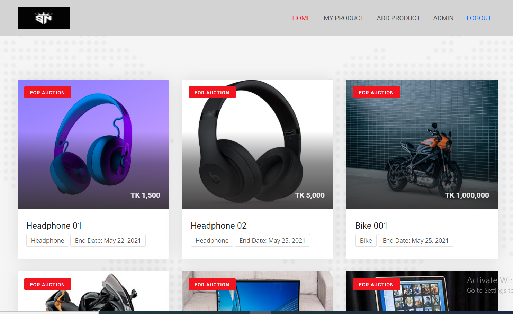
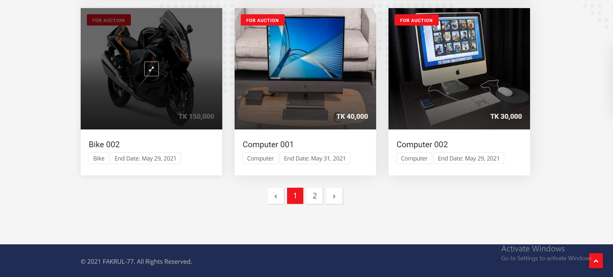
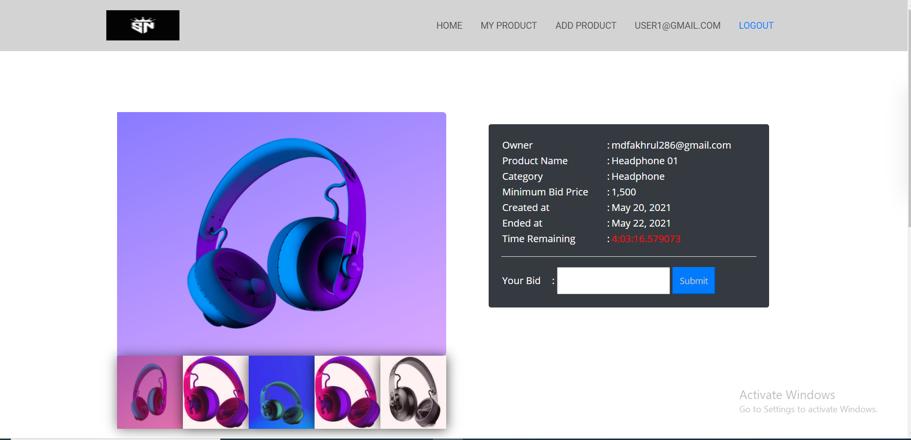
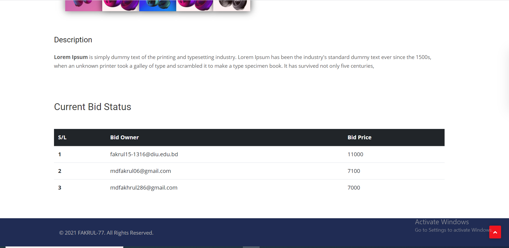
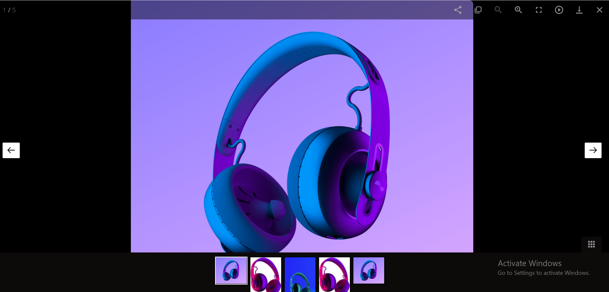
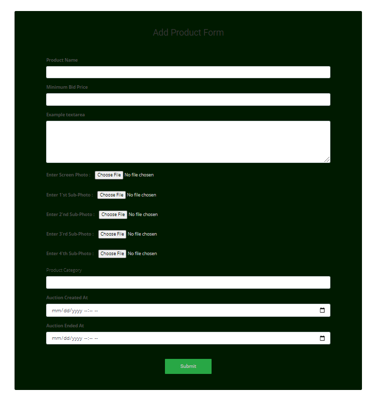
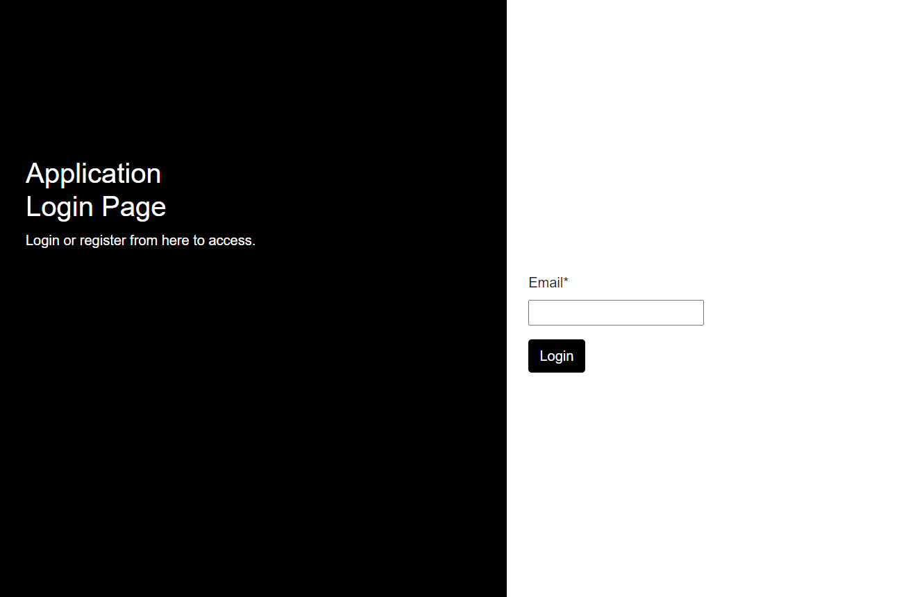
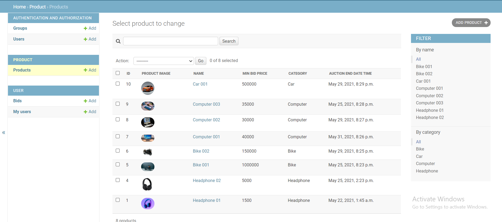

#Online Auction Site Using Djagno
## Steup
- ####It is best to use the python virtualenv tool to build locally:
        https://github.com/FAKRUL-77/sohoj-nilam.git
        Use "cd SohojNilam" to go inside the project directory   
---
- #### Create Virtual environment and Install dependencies
        Use "python -m venv environment_neme" to create a python virtual environment
        Use "environment_neme/scripts/activate" to active the existing environment
        After activating virtual environment use "pip install -r requirements.txt" to install dependencies
---
- #### Make .env file to the root directory of the project. .env file should contains following variables.
        SECRET_KEY=
        ALLOWED_HOSTS=
        DEBUG=
        SQLITE_URL=
        CORS_ALLOWED_ORIGINS=
- #### Run these command in the terminal
        python manage.py makemigrations
        python manage.py migrate
        python manage.py runserver
---
- ### Then visit http://localhost:8000 to view the output of the app
        The default admin username and password is admin and admin respectively
---
- ## Deploy to Heroku
  This application is currently deployed in Heroku.
  To Visit follow this link: https://sohoj-nilam1.herokuapp.com/
  
--- 
# The outlook of this app is:
  
  
  
  
  
  
  
  
  